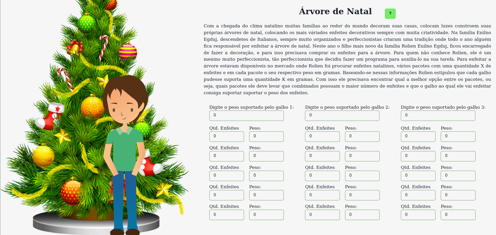
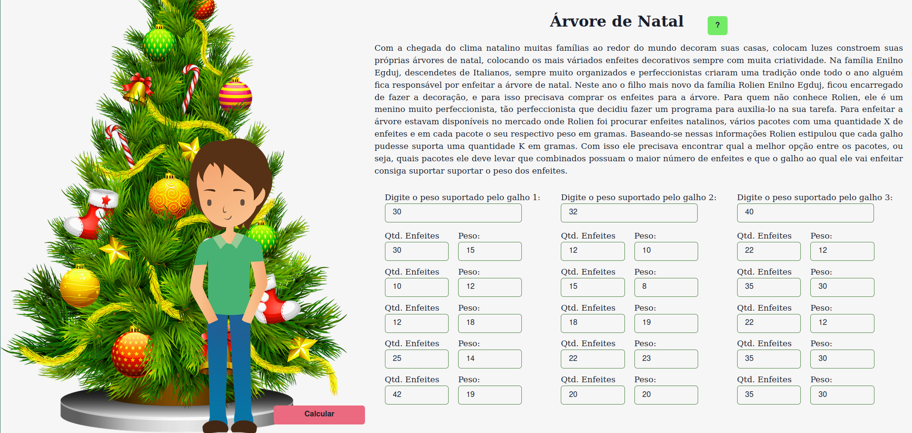
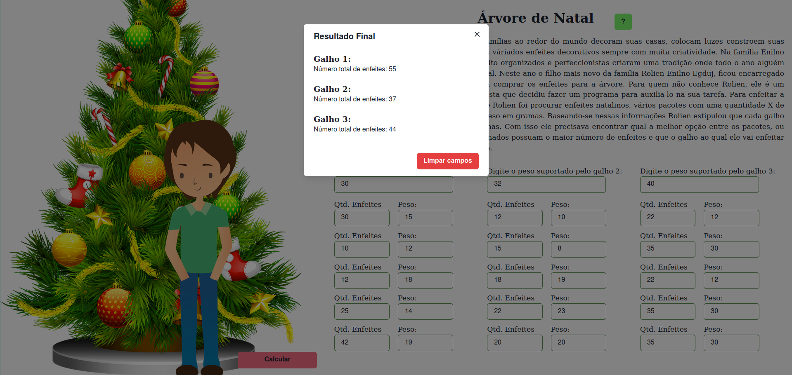

# Programação Dinâmica - Árvore de Natal

**Número da Lista**: 10<br>
**Conteúdo da Disciplina**: Programação Dinâmica<br>

## Alunos
|Matrícula | Aluno |
| -- | -- |
| 15/0120371  |  Bruno Oliveira Dantas |
| 17/0031438 |  Dâmaso Júnio Pereira Brasileo |

## Sobre 

O projeto Árvore de Natal é a solução do exercício 2026 do Uri Online Judge! 
É um verdadeiro desafio, sobre o pequeno Rolien tenta calcular o máximo de enfeites possíveis para colocar na sua árvore de natal.

É possível acessar o exercício através do link: [URI 2026](https://www.urionlinejudge.com.br/judge/pt/problems/view/2026)

## Screenshots







## Vídeo

Faça o Download do vídeo neste link: https://github.com/projeto-de-algoritmos/PD_ArvoreDeNatal/blob/master/Video_Explicativo.mp4

## Instalação 
**Linguagem**: TypeScript<br>
**Framework**: ReactJS + Chakra UI<br>

Para instalação do projeto, é necessário executar os seguintes comandos:
```
git clone https://github.com/projeto-de-algoritmos/PD_ArvoreDeNatal

cd PD_ArvoreDeNatal 

yarn install
```

## Uso 

Para execução do projeto é necessário, após a instalação:
```
cd Greed_DoraAventureira

yarn start
```

## Outros 
O comando `yarn` pode ser trocado por `npm`:
```
npm install

npm start
```

É necessário ter o `NPM` ou `YARN` instalado.
